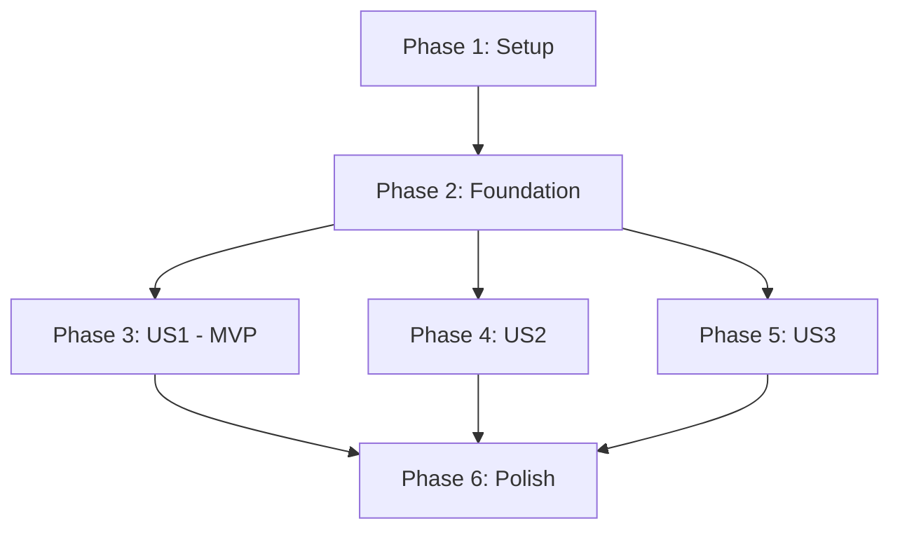

# Tasks: CellXGene Explorer

**Input**: Design documents from `/specs/001-cellxgene-explorer/`
**Prerequisites**: plan.md, spec.md, research.md, data-model.md, contracts/, quickstart.md

**Tests**: Unit tests are mandated by the constitution (Principle I - Non-Negotiable). Each phase includes testing tasks.

**Organization**: Tasks are grouped by user story to enable independent implementation and testing of each story.

## Format: `[ID] [P?] [Story] Description`

- **[P]**: Can run in parallel (different files, no dependencies)
- **[Story]**: Which user story this task belongs to (e.g., US1, US2, US3)
- Include exact file paths in descriptions

## Path Conventions

Multi-container web application structure:
- **Landing Page**: `services/landing-page/src/`
- **CellXGene**: `services/cellxgene/`
- **Nginx**: `services/nginx/`
- **Tests**: `services/{service}/tests/` and `tests/e2e/`
- **Scripts**: `scripts/`
- **Docs**: `docs/`

---

## Phase 1: Setup (Shared Infrastructure)

**Purpose**: Project initialization and Docker environment setup

- [X] T001 Create root project structure (docker-compose.yml, .env.example, README.md, .gitignore)
- [X] T002 [P] Create services directory structure (services/landing-page/, services/cellxgene/, services/nginx/)
- [X] T003 [P] Create data directory structure (data/datasets/, data/logs/)
- [X] T004 [P] Create scripts directory with utilities (scripts/validate-datasets.py, scripts/deploy.sh, scripts/backup-data.sh)
- [X] T005 [P] Create docs directory with documentation templates (docs/architecture.md, docs/deployment.md, docs/troubleshooting.md, docs/adding-datasets.md)
- [X] T006 [P] Create tests directory for end-to-end tests (tests/e2e/)
- [X] T007 Write main README.md with project overview, quick start, and architecture overview
- [X] T008 Write docker-compose.yml with service definitions for landing-page, cellxgene, nginx
- [X] T009 Write .env.example with all configuration variables (DATA_DIRECTORY, LOG_DIRECTORY, ports, worker config)
- [X] T010 [P] Configure .gitignore for Python, Docker, logs, and data files

---

## Phase 2: Foundational (Blocking Prerequisites)

**Purpose**: Core infrastructure that MUST be complete before ANY user story can be implemented

**⚠️ CRITICAL**: No user story work can begin until this phase is complete

- [X] T011 Write dataset validation module in scripts/validate-datasets.py (validates h5ad format, checks metadata JSON, fails fast on errors)
- [X] T012 Create singlecellschemas.org JSON schema validator in scripts/validate-datasets.py
- [X] T013 Write configuration management module for reading .env and validating environment variables
- [X] T014 Create logging infrastructure with structured JSON logging to data/logs/ directory
- [X] T015 Write Docker healthcheck endpoints specification for all services
- [X] T016 Create error handling framework with explicit exception types (DatasetNotFoundError, ValidationError, ServiceUnavailableError)
- [X] T017 Write pytest configuration and test fixtures in pytest.ini and conftest.py
- [X] T018 Create CI/CD pipeline configuration (.github/workflows/ or equivalent) for automated testing
- [X] T019 Write deployment script (scripts/deploy.sh) for one-command deployment
- [X] T020 Create backup utility script (scripts/backup-data.sh) for data directory

**Checkpoint**: Foundation ready - user story implementation can now begin in parallel

---

## Phase 3: User Story 1 - Dataset Selection and Exploration (Priority: P1) 🎯 MVP

**Goal**: Researchers can browse available datasets and launch CellXGene for interactive exploration

**Independent Test**: Start Docker container, view dataset catalog, click dataset, CellXGene loads successfully

### Tests for User Story 1

> **NOTE: Write these tests FIRST, ensure they FAIL before implementation**

- [X] T021 [P] [US1] Write unit tests for Dataset model in services/landing-page/tests/unit/test_dataset_model.py
- [X] T022 [P] [US1] Write unit tests for dataset scanning logic in services/landing-page/tests/unit/test_dataset_scanner.py
- [X] T023 [P] [US1] Write contract tests for /api/datasets endpoint in services/landing-page/tests/contract/test_datasets_api.py
- [X] T024 [P] [US1] Write contract tests for /api/datasets/{id}/launch endpoint in services/landing-page/tests/contract/test_launch_api.py
- [X] T025 [P] [US1] Write integration test for dataset catalog generation in services/landing-page/tests/integration/test_catalog.py
- [X] T026 [P] [US1] Write end-to-end test for full user journey (view catalog → launch CellXGene) in tests/e2e/test_dataset_exploration.py

### Landing Page Service Implementation

- [X] T027 [P] [US1] Create Landing Page Dockerfile in services/landing-page/Dockerfile
- [X] T028 [P] [US1] Write requirements.txt with Flask/FastAPI, pytest, requests in services/landing-page/requirements.txt
- [X] T029 [P] [US1] Create Dataset model class in services/landing-page/src/models/dataset.py (id, filename, display_name, metadata, validation)
- [X] T030 [P] [US1] Create DatasetMetadata model class in services/landing-page/src/models/metadata.py (singlecellschemas.org fields)
- [X] T031 [US1] Implement DatasetScanner service in services/landing-page/src/services/scanner.py (scans data directory, pairs h5ad with JSON, validates)
- [X] T032 [US1] Implement DatasetCatalog service in services/landing-page/src/services/catalog.py (manages dataset list, filtering, sorting)
- [X] T033 [US1] Create /api/health endpoint in services/landing-page/src/routes/health.py
- [X] T034 [US1] Create /api/datasets endpoint (list) in services/landing-page/src/routes/datasets.py
- [X] T035 [US1] Create /api/datasets/{id} endpoint (detail) in services/landing-page/src/routes/datasets.py
- [X] T036 [US1] Create /api/datasets/{id}/launch endpoint (launch CellXGene) in services/landing-page/src/routes/datasets.py
- [X] T037 [US1] Create /api/datasets/{id}/metadata endpoint (raw JSON) in services/landing-page/src/routes/datasets.py
- [X] T038 [US1] Create Flask/FastAPI application initialization in services/landing-page/src/app.py (configure routes, CORS, error handlers)
- [X] T039 [US1] Write startup validation script in services/landing-page/src/startup.py (fail-fast if any dataset invalid)
- [X] T040 [US1] Create HTML landing page template in services/landing-page/src/templates/index.html (dataset catalog UI)
- [X] T041 [P] [US1] Create CSS styles in services/landing-page/src/static/css/styles.css
- [X] T042 [P] [US1] Create JavaScript for dataset interaction in services/landing-page/src/static/js/app.js (fetch datasets, handle clicks, launch CellXGene)
- [X] T043 [US1] Add access logging to all API endpoints with structured JSON logs
- [X] T044 [US1] Add error handling with explicit error types and user-friendly messages

### CellXGene Service Implementation

- [X] T045 [P] [US1] Create CellXGene Dockerfile in services/cellxgene/Dockerfile (install CellXGene v2.x, Gunicorn, Uvicorn)
- [X] T046 [P] [US1] Write requirements.txt with cellxgene, gunicorn, uvicorn in services/cellxgene/requirements.txt
- [X] T047 [P] [US1] Write Gunicorn configuration in services/cellxgene/gunicorn_conf.py (10 workers, 20GB per worker, Uvicorn worker class)
- [X] T048 [US1] Write entrypoint script in services/cellxgene/entrypoint.sh (startup validation, launch CellXGene with gunicorn)
- [X] T049 [US1] Configure CellXGene to read from /data/datasets volume mount
- [X] T050 [US1] Add healthcheck endpoint for CellXGene service
- [X] T051 [P] [US1] Write unit tests for CellXGene configuration in services/cellxgene/tests/unit/test_config.py

### Nginx Reverse Proxy Implementation

- [X] T052 [P] [US1] Create Nginx Dockerfile in services/nginx/Dockerfile
- [X] T053 [US1] Write nginx.conf with routing rules (/ → landing-page, /api → landing-page API, /cellxgene → cellxgene service)
- [X] T054 [US1] Configure proxy timeouts (5min for CellXGene, 30s for API)
- [X] T055 [US1] Configure gzip compression for static files
- [X] T056 [US1] Add access logging in standard format
- [X] T057 [US1] Configure CORS headers for API endpoints
- [X] T058 [P] [US1] Create SSL configuration stub for future HTTPS support in services/nginx/ssl/

### Docker Compose Integration

- [X] T059 [US1] Update docker-compose.yml with landing-page service definition (build, ports, volumes, environment, healthcheck)
- [X] T060 [US1] Update docker-compose.yml with cellxgene service definition (build, ports, volumes, deploy.resources, healthcheck)
- [X] T061 [US1] Update docker-compose.yml with nginx service definition (build, ports, depends_on, volumes)
- [X] T062 [US1] Configure volume mounts for data directory (read-only for services)
- [X] T063 [US1] Configure Docker networks for service isolation
- [X] T064 [US1] Add resource limits to docker-compose.yml (memory limits for CellXGene: 210GB total)

### Documentation for User Story 1

- [X] T065 [P] [US1] Write architecture documentation in docs/architecture.md (system diagram, component descriptions, data flow)
- [X] T066 [P] [US1] Update README.md with User Story 1 functionality and usage instructions
- [X] T067 [P] [US1] Write API documentation (auto-generate from OpenAPI spec or write manually)

### Testing & Validation

- [X] T068 [US1] Run all unit tests and verify 80%+ coverage: pytest services/landing-page/tests/unit/ --cov
- [X] T069 [US1] Run contract tests to validate API compliance with OpenAPI spec
- [X] T070 [US1] Run integration tests with Docker Compose test environment
- [X] T071 [US1] Run end-to-end test for complete user journey (catalog → launch → explore)
- [X] T072 [US1] Manual testing: verify dataset catalog displays correctly
- [X] T073 [US1] Manual testing: verify clicking dataset launches CellXGene
- [X] T074 [US1] Manual testing: verify CellXGene features work (filtering, clustering, visualization)
- [ ] T075 [US1] Load testing: verify 10 concurrent users can access system
- [ ] T076 [US1] Performance testing: verify dataset launch < 30 seconds

**Checkpoint**: At this point, User Story 1 (MVP) should be fully functional and testable independently. System can be deployed and used for core functionality.

---

## Phase 4: User Story 2 - Dataset Management (Priority: P2)

**Goal**: Administrators can easily add, update, or remove datasets without code changes

**Independent Test**: Add new h5ad + JSON, restart service, verify dataset appears in catalog

### Tests for User Story 2

- [ ] T077 [P] [US2] Write unit tests for dataset hot-reload logic in services/landing-page/tests/unit/test_hot_reload.py
- [ ] T078 [P] [US2] Write integration test for adding new dataset in services/landing-page/tests/integration/test_add_dataset.py
- [ ] T079 [P] [US2] Write integration test for removing dataset in services/landing-page/tests/integration/test_remove_dataset.py
- [ ] T080 [P] [US2] Write integration test for updating metadata in services/landing-page/tests/integration/test_update_metadata.py

### Implementation for User Story 2

- [ ] T081 [P] [US2] Create dataset validation CLI tool in scripts/validate-datasets.py (can be run standalone before restart)
- [ ] T082 [US2] Implement file watcher for data directory (optional - auto-detect new datasets without restart)
- [ ] T083 [US2] Add /api/datasets/reload endpoint (POST) to trigger rescan without full service restart
- [ ] T084 [US2] Implement metadata validation with detailed error messages for each validation failure
- [ ] T085 [US2] Add dataset validation report generation (HTML/JSON output for admins)
- [ ] T086 [P] [US2] Write dataset addition guide in docs/adding-datasets.md (step-by-step with examples)
- [ ] T087 [P] [US2] Create example dataset with metadata in data/datasets/example_pbmc_3k.h5ad and example_pbmc_3k.json
- [ ] T088 [P] [US2] Write metadata template generator script in scripts/create-metadata-template.py (generates JSON skeleton from h5ad)
- [ ] T089 [US2] Add admin dashboard page (optional) in services/landing-page/src/templates/admin.html showing dataset status and validation errors
- [ ] T090 [US2] Add logging for all dataset management operations (add, remove, update)

### Testing & Validation

- [ ] T091 [US2] Test: Add new dataset while service is running, verify it appears after restart
- [ ] T092 [US2] Test: Remove dataset, verify it disappears from catalog
- [ ] T093 [US2] Test: Update metadata JSON, verify changes reflect in catalog
- [ ] T094 [US2] Test: Add invalid h5ad file, verify service fails to start with clear error message
- [ ] T095 [US2] Test: Add h5ad without metadata JSON, verify service fails with clear error
- [ ] T096 [US2] Test: Run validation script on datasets before restart, verify errors caught early

**Checkpoint**: Dataset management is now simple and safe. Admins can manage datasets in under 5 minutes.

---

## Phase 5: User Story 3 - Additional Services Integration (Priority: P3)

**Goal**: Extend system with complementary services (docs, tutorials, analysis tools)

**Independent Test**: Add new service to docker-compose.yml, verify accessible and integrated

### Tests for User Story 3

- [ ] T097 [P] [US3] Write integration test for adding new service container in tests/integration/test_add_service.py
- [ ] T098 [P] [US3] Write integration test for shared volumes between services in tests/integration/test_shared_volumes.py

### Implementation for User Story 3

- [ ] T099 [P] [US3] Add service extensibility documentation in docs/extending-services.md (how to add new containers)
- [ ] T100 [US3] Update nginx.conf to support dynamic service routing (proxy_pass to additional services)
- [ ] T101 [US3] Add navigation menu component to landing page in services/landing-page/src/templates/includes/nav.html
- [ ] T102 [US3] Implement service discovery mechanism (read service list from docker-compose.yml or config file)
- [ ] T103 [US3] Create example documentation service in docker-compose.yml (nginx serving static docs)
- [ ] T104 [P] [US3] Write documentation for shared volume patterns in docs/extending-services.md
- [ ] T105 [US3] Add service health monitoring dashboard showing status of all services
- [ ] T106 [P] [US3] Create example tutorial service (Jupyter notebooks) in services/tutorials/ (optional)

### Testing & Validation

- [ ] T107 [US3] Test: Add documentation service to docker-compose.yml, verify accessible at /docs
- [ ] T108 [US3] Test: Add navigation link to landing page, verify links to documentation service
- [ ] T109 [US3] Test: Configure shared volume between services, verify data accessible from both
- [ ] T110 [US3] Test: Stop/start additional service independently, verify main services unaffected

**Checkpoint**: System is now extensible for future services without modifying core functionality.

---

## Phase 6: Polish & Cross-Cutting Concerns

**Purpose**: Improvements that affect multiple user stories, documentation, and deployment readiness

- [ ] T111 [P] Write comprehensive README.md with installation, usage, troubleshooting in project root
- [ ] T112 [P] Write deployment guide in docs/deployment.md (OpenNebula and CyVerse specific instructions)
- [ ] T113 [P] Write troubleshooting guide in docs/troubleshooting.md (common issues and solutions from quickstart.md)
- [ ] T114 [P] Write architecture documentation in docs/architecture.md (diagrams, component descriptions, data flow)
- [ ] T115 [P] Add inline code comments to all complex logic (explain "why", not "what")
- [ ] T116 [P] Add docstrings to all functions and classes (purpose, parameters, return values, exceptions)
- [ ] T117 Write CHANGELOG.md documenting all features and changes
- [ ] T118 Write CONTRIBUTING.md with guidelines for future development
- [ ] T119 [P] Create architecture diagrams (system overview, data flow, deployment) using Mermaid or draw.io
- [ ] T120 [P] Add code linting and formatting configuration (.pylintrc, .flake8, pyproject.toml for black)
- [ ] T121 Run linters on all Python code and fix issues
- [ ] T122 Run security scan on Docker images (Trivy, Clair) and fix critical vulnerabilities
- [ ] T123 [P] Add monitoring and metrics collection (optional - Prometheus + Grafana)
- [ ] T124 [P] Add automated backup scripts with cron examples in scripts/backup-data.sh
- [ ] T125 Write deployment automation for CyVerse/OpenNebula in scripts/deploy.sh
- [ ] T126 Create example .env files for different environments (.env.development, .env.production)
- [ ] T127 [P] Add SSL/HTTPS configuration instructions in docs/deployment.md
- [ ] T128 [P] Run final end-to-end test suite covering all user stories
- [ ] T129 Run quickstart.md validation (deploy from scratch following guide, verify all steps work)
- [ ] T130 Perform accessibility audit on landing page UI (basic WCAG compliance)
- [ ] T131 Review all error messages for clarity and helpfulness (align with Constitution Principle VI)
- [ ] T132 Create demo video or GIF showing system in action (optional)
- [ ] T133 Prepare release notes and tag version 1.0.0

---

## Dependencies & Execution Order

### Story Dependencies (Completion Order)



**User Story 1 (P1) MUST complete before US2 or US3** because they extend the base system.

**Foundation MUST complete before ANY user story** because it provides validation, logging, error handling.

### Within User Story 1 (Critical Path)

```
T027-T028 (Dockerfiles) → T029-T030 (Models) → T031-T032 (Services) → T033-T037 (API Endpoints) → T038-T039 (App Init) → T040-T042 (UI) → T059-T064 (Docker Compose) → Testing
```

**Tests (T021-T026) should be written FIRST** (parallel to implementation), following TDD principles.

### Parallel Opportunities

**Phase 1 (Setup)**: T002-T006 can all run in parallel (different directories)

**Phase 2 (Foundation)**: T011-T012, T014, T016-T017, T019-T020 can run in parallel

**User Story 1 - Models & Routes**: 
- T029-T030 (models) - parallel
- T033-T037 (API routes) - parallel after models done
- T041-T042 (static assets) - parallel with backend
- T052-T058 (Nginx config) - parallel with services
- T065-T067 (documentation) - parallel throughout

---

## Parallel Example: User Story 1

Developer A and B can work concurrently:

```bash
# Developer A: Backend API
Task: "Create Dataset model in services/landing-page/src/models/dataset.py" (T029)
Task: "Implement DatasetScanner service in services/landing-page/src/services/scanner.py" (T031)
Task: "Create /api/datasets endpoint in services/landing-page/src/routes/datasets.py" (T034)

# Developer B: Frontend UI
Task: "Create HTML landing page template in services/landing-page/src/templates/index.html" (T040)
Task: "Create CSS styles in services/landing-page/src/static/css/styles.css" (T041)
Task: "Create JavaScript for dataset interaction in services/landing-page/src/static/js/app.js" (T042)

# Developer C: Infrastructure
Task: "Create Nginx Dockerfile in services/nginx/Dockerfile" (T052)
Task: "Write nginx.conf with routing rules" (T053)
Task: "Configure Docker Compose integration" (T059-T064)
```

---

## Implementation Strategy

### MVP First (User Story 1 Only)

1. Complete Phase 1: Setup (T001-T010)
2. Complete Phase 2: Foundation (T011-T020) - **CRITICAL - blocks all stories**
3. Complete Phase 3: User Story 1 (T021-T076)
4. **STOP and VALIDATE**: Deploy and test User Story 1 independently
5. Deploy MVP to OpenNebula/CyVerse if ready

### Incremental Delivery

1. Foundation (T001-T020) → Foundation ready for all stories
2. Add User Story 1 (T021-T076) → Test independently → **Deploy MVP!**
3. Add User Story 2 (T077-T096) → Test independently → Deploy update
4. Add User Story 3 (T097-T110) → Test independently → Deploy update
5. Polish (T111-T133) → Final release

### Parallel Team Strategy

With 3 developers:

1. All complete Phase 1 + 2 together (T001-T020)
2. Once Foundation done:
   - Developer A: User Story 1 backend (T021-T044, T059-T064)
   - Developer B: User Story 1 frontend + Nginx (T040-T042, T052-T058)
   - Developer C: User Story 1 CellXGene service + docs (T045-T051, T065-T067)
3. Integration and testing together (T068-T076)
4. Deploy MVP, then split work on US2 and US3

---

## Notes

- **[P] tasks** = different files, no dependencies, can run in parallel
- **[Story] label** (US1, US2, US3) maps task to specific user story for traceability
- Each user story should be **independently completable and testable**
- **Tests written FIRST** following TDD (Constitution Principle I)
- **Fail-fast validation** implemented throughout (Constitution Principle IV)
- **Comprehensive documentation** at all levels (Constitution Principles III, V, VI)
- **Stop at any checkpoint** to validate story independently before proceeding
- Commit after each task or logical group
- Avoid: vague tasks, same file conflicts, cross-story dependencies that break independence

---

**Total Tasks**: 133
**MVP (US1)**: 76 tasks (T001-T076)
**Task Distribution**:
- Setup: 10 tasks
- Foundation: 10 tasks
- User Story 1 (P1): 56 tasks
- User Story 2 (P2): 20 tasks
- User Story 3 (P3): 14 tasks
- Polish: 23 tasks

**Parallel Opportunities**: ~40% of tasks can run in parallel (marked with [P])

**Estimated Effort**: 
- MVP (US1): 2-3 weeks (1-2 developers)
- Full Feature: 4-5 weeks (1-2 developers)
- With 3 developers (parallel): 2-3 weeks for full feature

**Critical Path**: Phase 1 → Phase 2 → US1 Backend → US1 Integration → US1 Testing

---

**Status**: Task breakdown complete. Ready for implementation with `/speckit.implement`.
